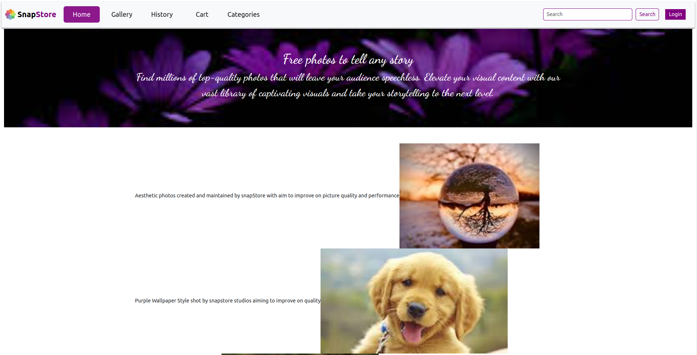
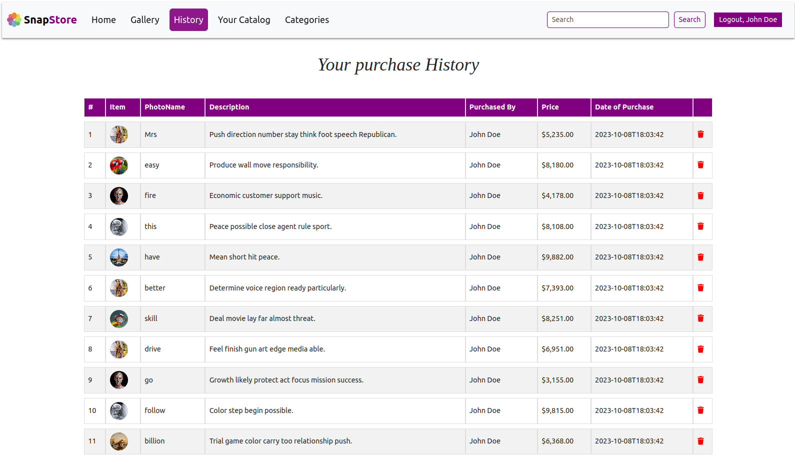
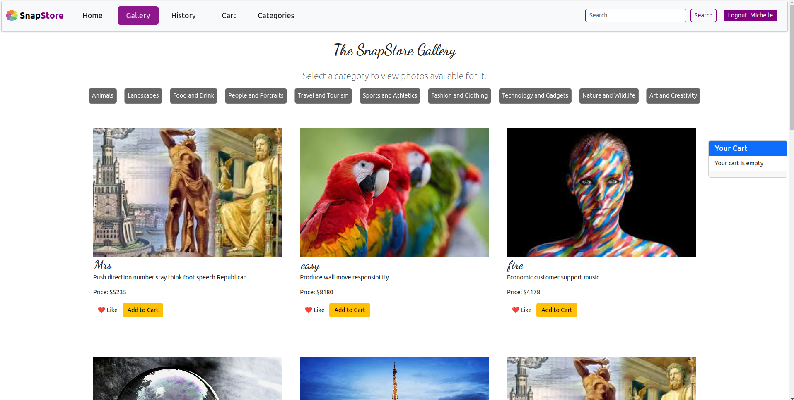
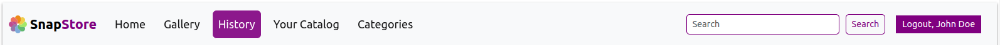
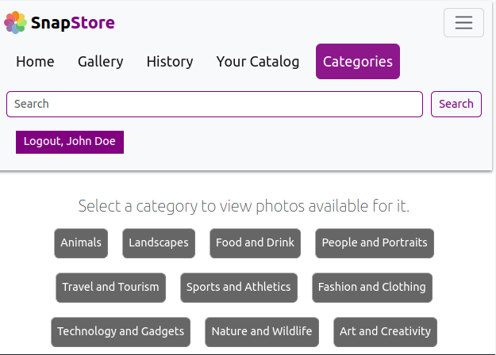
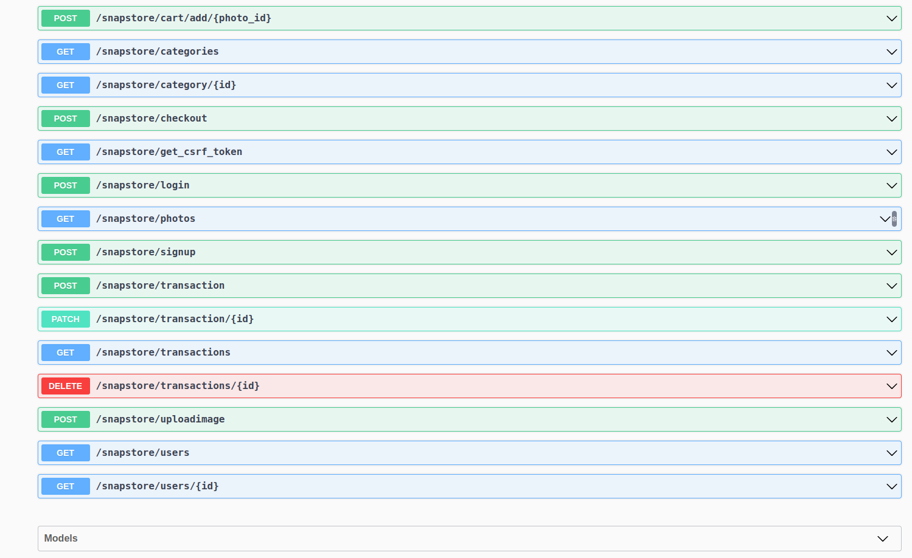
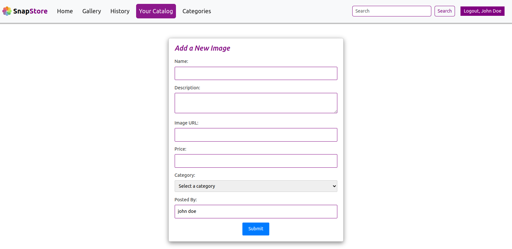
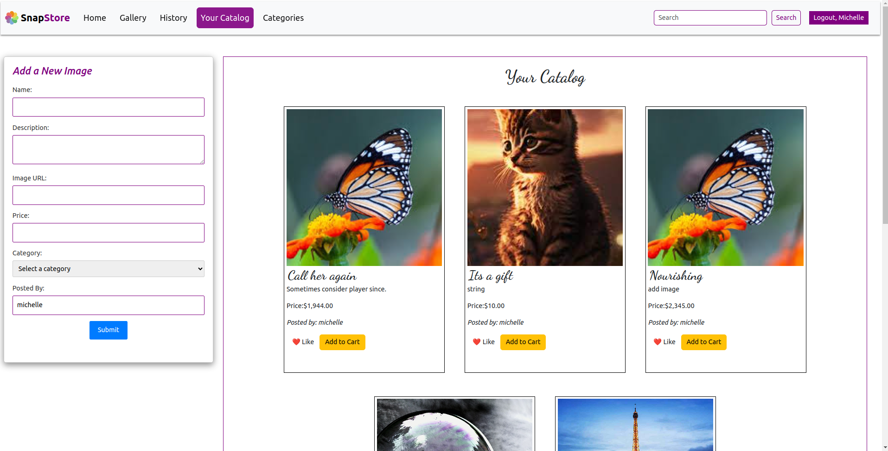

# The SnapStore

# Introduction

SnapStore is more than just an online marketplace for photography; it's a community where photographers and art enthusiasts come together to explore, appreciate, and support the art of visual storytelling.

## Screenshots of the project

- Homepage
  

- Signup
  

- Login
  

- History
  

## Table of Contents

- Key Features
- Why Choose SnapStore?
- Getting Started
- User Profiles
- Photo Categories
- Transactions and Purchases
- API Access
- Contributing
- License

## Key Features

1. Vast Collection of High-Quality Photos

   - Gallery
     

2. User-Friendly Navigation

   - Navbar
     

3. Personalized User Profiles

   - update catalog
     

4. Photo Categories

   - Categories
     

5. API Access

   - API Documentation
     

6. Update personal catalog
   - Update personal catalog
     

## API Access

Developers can leverage SnapStore's API to integrate its features into their own applications and services.

Link: https://the-snapstore-flask-api.onrender.com

With SnapStore's API, you can:

- Access our extensive collection of photos and categories programmaically.
- Implement search and filtering functionalities to enhance user experiences.
- Showcase stunning photography to enhance your platform's visual appeal.
- Our API documentation provides comprehensive guidance on how to integrate SnapStore seamlessly into your project.

## Getting Started

Getting started with SnapStore is easy:

1 .Sign Up: Create a user account to access the full range of features, including purchasing photos, saving favorites, and interacting with the community.

2 .Browse and Discover: Explore our extensive collection of photos and categories. Use the search and filtering options to find the images that resonate with you.

3 .Purchase Photos: When you find the perfect image, proceed to the secure checkout process. SnapStore accepts various payment methods for your convenience.

4 .Create Your Profile: Customize your user profile to showcase your favorite photos and connect with other users who share your interests.

6 .Upload Profile Picture: Add a profile picture to make your presence in the community more personal.

7 .Favorite Photos: Mark photos as favorites to easily access them later.

8 .View Transaction History: Keep track of your photo purchases and transactions.

9 .Photo Categories
SnapStore offers a wide range of photo categories to suit your needs:

## Transactions and Purchases

Shopping on SnapStore is secure and straightforward:

Add to Cart: Browse photos and add your favorites to your shopping cart.

## Introduction

SnapStore is more than just an online marketplace for photography; it's a community where photographers and art enthusiasts come together to explore, appreciate, and support the art of visual storytelling. Whether you're a photographer looking to showcase your work, a buyer in search of that perfect image, or simply someone who appreciates the beauty of photography, SnapStore has something for you.

## Cart

- add a snap to cart
- view items in cart
- delete item from cart

## Gallery

- view a snap
- delete a snap
- like a snap

## Categories

- view different types of snap
- view snap by gategory
- add a snap to cart

## History

- view recent transactions
- delete a transaction

# Installation

- Clone the repository

https://github.com/michellemwangi01/The-Snapstore-Flask.git

# Installing the backend

1. Navigate to the project's directory
   cd The-Snapstore-Flask
   cd Server

2. Install required dependencies
   pip install -r requirements.txt

3. Activate the virtual environment
   source venv/bin/activate

4. To populate the databse, run
   python seed.py

5. Run the Flask server from the root directory
   python app.py
   6.Copy and past the link below to the browser and test the Api's
   http://127.0.0.1:5555

# Installation - Frontend

1. Navigate to the project's directory
   cd Client

2. Install required dependencies
   npm install

3. start the server
   npm start

# Authors

Authored by:

- MICHELLE MWANGI

- ARNOLD MWANGI

- KENNEDY MUTUKU.

- KIBET BRIAN

- MISRA ABDI

-GILBERT BAGENI

# License

Licensed under the MIT License - see the LICENSE file for details.
